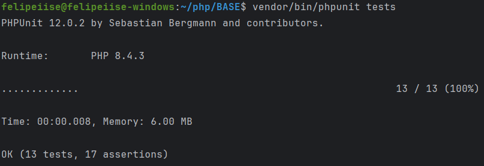
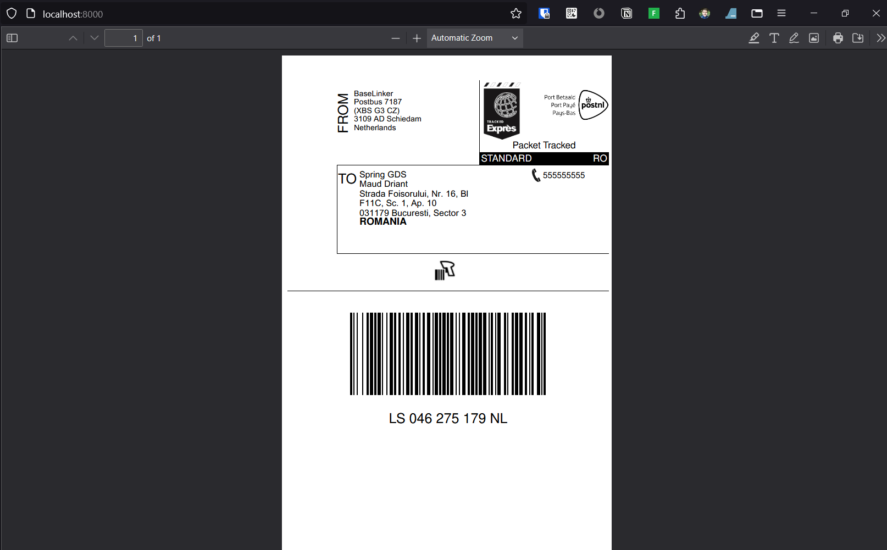

# BASE
Base Recruitment Process

Clone the project:

```php
mkdir -p ~/task/felipeiise
cd ~/task/felipeiise
git clone https://github.com/felipeiise/base.git
```

Install PHP 8.4 in Ubuntu 22.04:

```bash
sudo apt install software-properties-common -y
sudo add-apt-repository ppa:ondrej/php
sudo apt update
sudo apt install php8.4-cli
sudo apt install php8.4-curl php8.4-xml php8.4-mbstring

sudo update-alternatives --set php /usr/bin/php8.4
```

Install composer to support PHP 8.4:

```bash
cd ~/
php -r "copy('https://getcomposer.org/installer', 'composer-setup.php');"
php8.4 composer-setup.php
rm -rf composer-setup.php
sudo mv composer.phar /usr/bin/composer
composer -V
```

Install project dependencies:

```bash
cd ~/task/felipeiise/base
composer install
```

Run the project:

```php
cd ~/task/felipeiise/base
php -S localhost:8000
```

Navigate to [http://localhost:8000](http://localhost:8000)

Run unit tests:

```bash
cd ~/task/felipeiise/base
vendor/bin/phpunit tests
```



